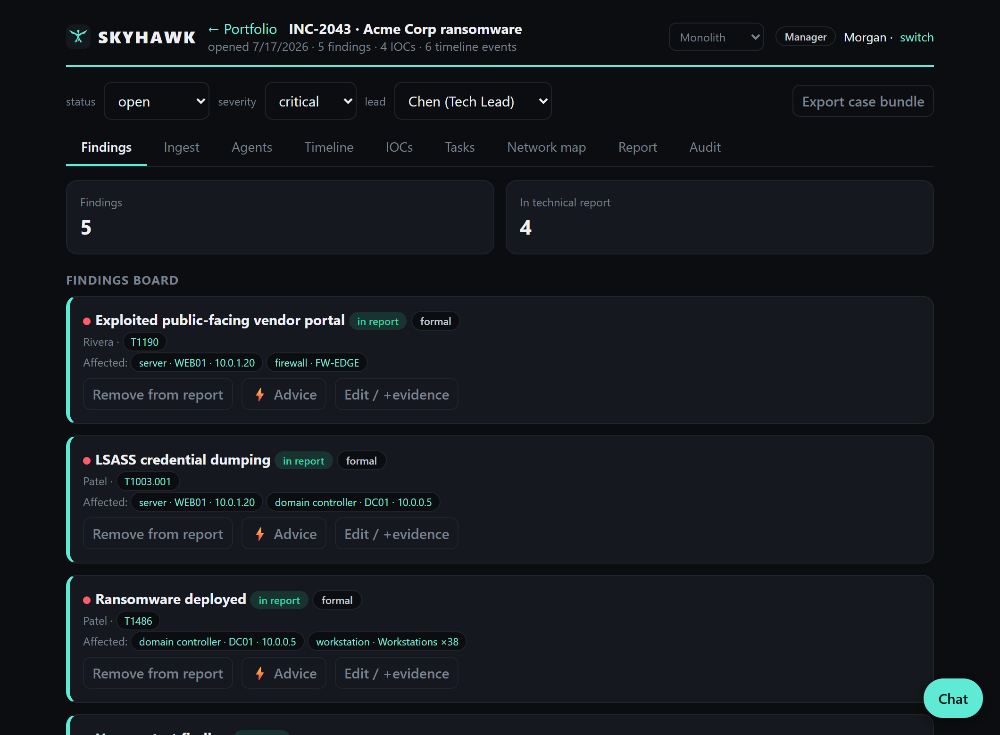
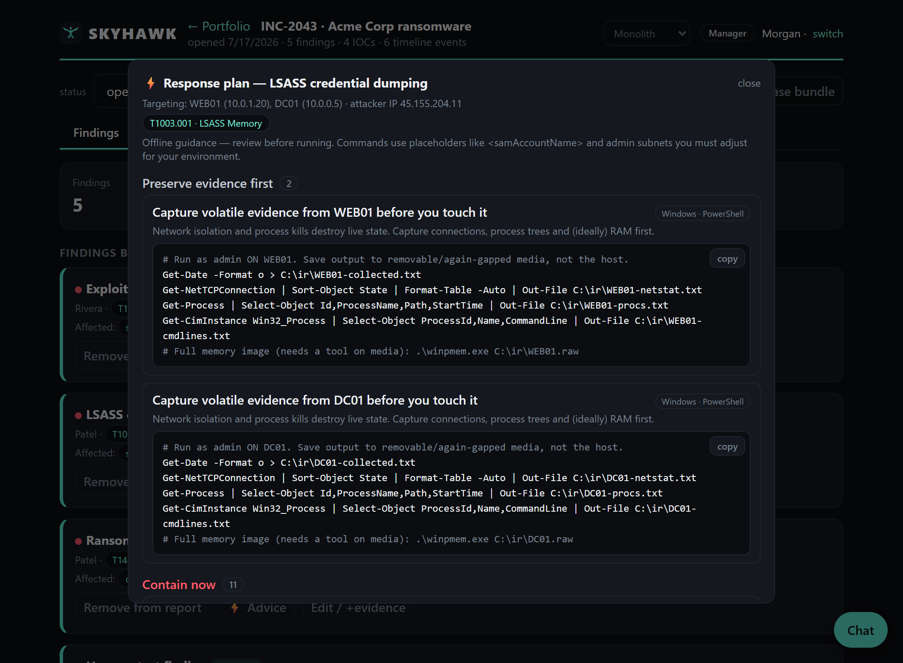
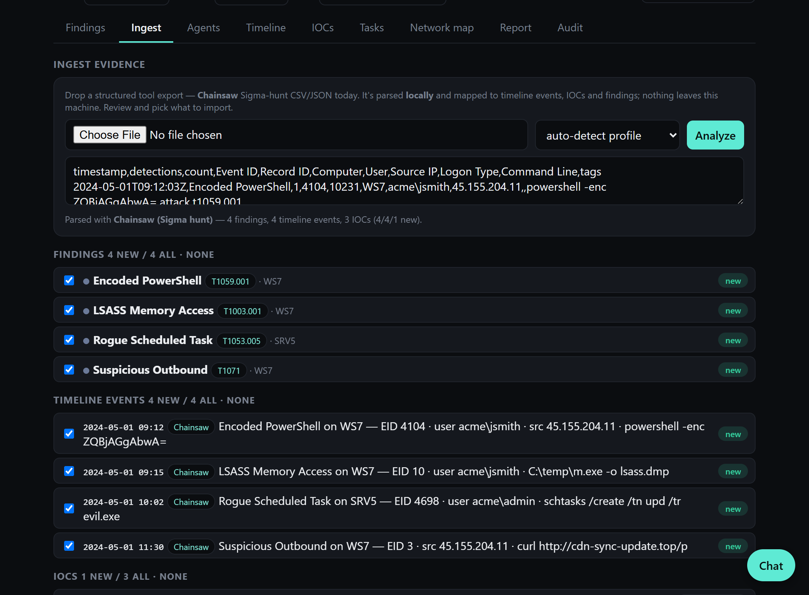
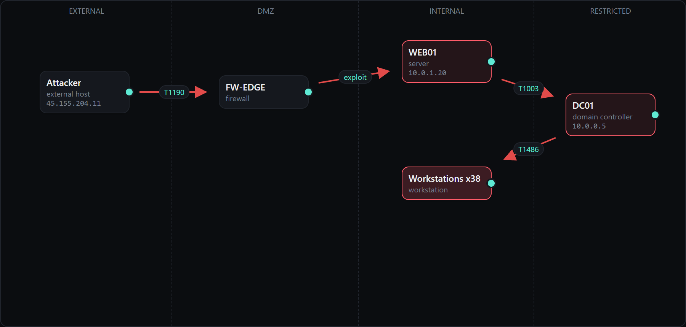
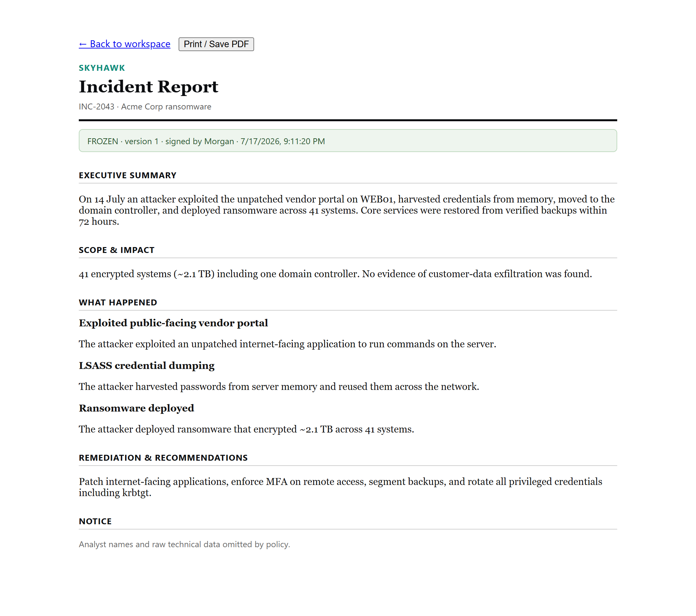
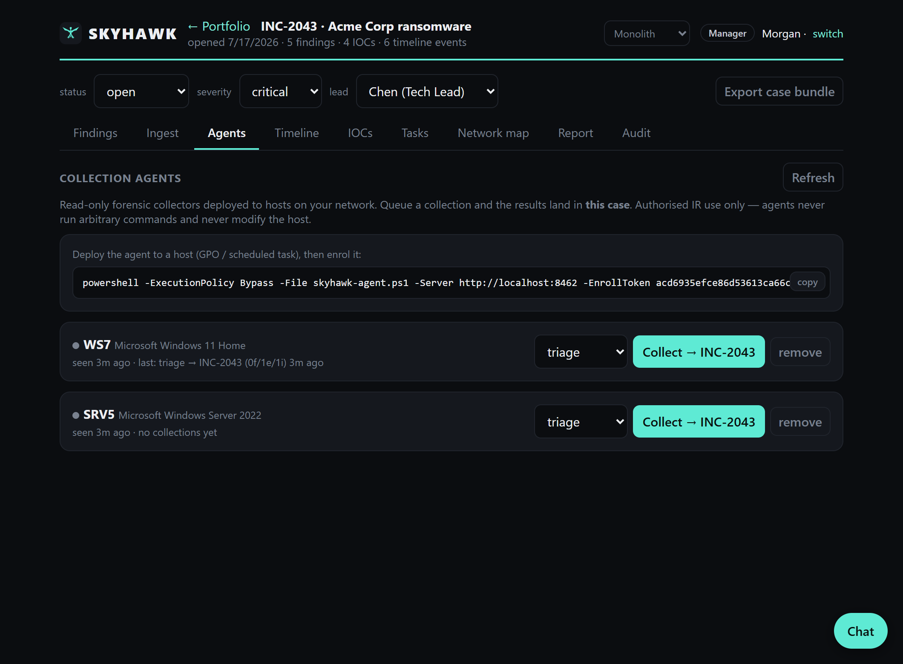

<div align="center">

# 🦅 SKYHAWK

**The air-gapped case file for blue teams.**

Work an incident end to end without ever leaving `localhost`: capture findings
with evidence, pull triage off your endpoints, map the intrusion to ATT&CK, get
the exact commands to contain it, and hand over a signed report. No cloud, no
database, no npm install.

[](#security)
[](#why-skyhawk)
[](#quick-start)
[](LICENSE)

[Quick start](#quick-start) · [Features](#what-you-get) · [Air-gapped install](#air-gapped-install) · [Collection agents](#collection-agents) · [Security](#security)

</div>

<p align="center">
  
</p>

---

## Why SKYHAWK

Most incident-response tooling assumes an internet connection, a database
cluster, and a pile of dependencies to keep patched. That is a bad fit for a
classified enclave, a field kit, or anywhere the network is the thing you do not
trust.

SKYHAWK is the opposite. It is a single Node.js process with **zero runtime
dependencies** that runs on a laptop or a LAN and never phones home. It still
does the whole job: a real case lifecycle, evidence handling with integrity
hashes, a hash-chained audit trail, and a frozen, signed report at the end. If
you have used IRIS, TheHive, or Velociraptor and wished one of them ran
completely offline with nothing to install, that is the gap this fills.

Built for analysts, leads, and managers who have to be able to say *exactly*
what happened and prove they did not touch the evidence.

## What you get

**Investigate.** Log findings with typed affected systems, screenshots that are
SHA-256 hashed on upload, verbatim queries and tooling. Build the environment on
a drag-and-drop network map. Reconstruct the attack on an incident timeline.
Track indicators that get auto-classified (IP, domain, URL, hash, CVE, and more)
and pulled straight out of your finding text.

**Ingest and collect.** Drop a **Chainsaw** Sigma-hunt export or a **Suricata**
`eve.json` into the Ingest tab and it becomes findings, timeline events and IOCs,
deduped against the case — Suricata alerts are grouped by signature, mapped to
ATT&CK from the rule metadata, with the source/destination and any file hashes
pulled out as IOCs. Deploy the read-only **collection agent** to hosts on your
network and pull live triage back into a case with one click — no third-party EDR
required.

**Understand and respond.** Every technique in the **full MITRE ATT&CK Enterprise
matrix** is searchable, with a keyword suggester so you do not need to memorise
IDs. Then the **response advisor** turns any finding into a concrete, phased plan
with commands you can copy and paste: isolate `WEB01`, kill the attacker's SSH
session, roll the exposed credentials, reset krbtgt, block the C2 at the
perimeter. It covers all 200 techniques, offline, with no model behind it.

**Report.** The technical report is live and credited to the analyst. The formal
report is the deliverable: a lead flags findings and writes plain-language
summaries, a manager freezes and signs it, and you get an immutable, versioned
snapshot with analyst names and raw detail stripped by policy. Both print
straight to PDF.

**Prove it.** Every action on a case lands in a tamper-evident, hash-chained
audit log that is re-verified on every load and after a restart. Export a whole
case (evidence, timeline, IOCs, audit chain and all) as one file to move between
enclaves; the chain is re-checked on import.

**Run it your way.** Role-based access (Analyst / Tech Lead / Manager) with real
scrypt-hashed auth and server-side sessions. File store by default, Postgres with
one env flip. Optional HTTPS. Per-account themes. A local team chat with DMs.

## Quick start

You need Node.js 18 or newer. There is nothing to build and nothing to
`npm install` — the app uses only built-in modules.

```bash
git clone https://github.com/xGhst0/skyhawk && cd skyhawk
node server.js
```

Open **http://localhost:8462** and sign in as `Morgan` / `skyhawk`.

Prefer a one-liner that also installs Node if it is missing and registers a
service that survives reboots?

```bash
# Linux / macOS
curl -fsSL https://raw.githubusercontent.com/xGhst0/skyhawk/main/install.sh | bash
```

```powershell
# Windows (PowerShell)
irm https://raw.githubusercontent.com/xGhst0/skyhawk/main/install.ps1 | iex
```

## Air-gapped install

For a box with no internet at all, build a self-contained bundle on a machine
that *does* have internet. It packs SKYHAWK together with the Node.js runtime,
checksum-verified against nodejs.org, into a single tarball.

```bash
curl -fsSL https://raw.githubusercontent.com/xGhst0/skyhawk/main/bundle-airgap.sh | bash
```

Carry `skyhawk-airgap-linux-x64.tar.gz` (~46 MB) across on removable media, then
on the offline host:

```bash
tar -xzf skyhawk-airgap-linux-x64.tar.gz && ./skyhawk-airgap/run.sh
```

No `apt`, no `npm`, no installer. The bundled runtime is the only dependency and
it travels inside the tarball. Building for ARM? Add `ARCH=arm64`.

## First sign-in

The login screen is seeded with four accounts (password `skyhawk` — change these
before any real use):

| Name | Role | Can |
|------|------|-----|
| Morgan | Manager | everything, including freezing and signing the formal report |
| Chen | Tech Lead | curate the technical report, edit any finding, task collections |
| Rivera | Analyst | create and edit their own findings |
| Patel | Analyst | create and edit their own findings |

New users can register and pick a role from the login screen.

<table>
  <tr>
    <td></td>
    <td></td>
  </tr>
  <tr>
    <td align="center"><sub>Response advisor: copy-paste containment per finding</sub></td>
    <td align="center"><sub>Ingest: a Chainsaw export mapped into the case</sub></td>
  </tr>
  <tr>
    <td></td>
    <td></td>
  </tr>
  <tr>
    <td align="center"><sub>Network map: the intrusion path across zones</sub></td>
    <td align="center"><sub>The signed, frozen formal report</sub></td>
  </tr>
</table>

## Collection agents

SKYHAWK can pull read-only triage from hosts on your network. This is a forensic
collector for authorised incident response, not an EDR and not a remote-command
channel. You deploy it to machines you administer with your own tooling.

<p align="center">
  
</p>

1. Set an enrolment secret so agents enrol against a known token (otherwise a
   random one is generated per boot and written to the log). If SKYHAWK is
   installed as a service, bake the token in by passing it to the installer,
   which also pulls the latest code and restarts the service:

   ```bash
   curl -fsSL https://raw.githubusercontent.com/xGhst0/skyhawk/main/install.sh \
     | SKYHAWK_ENROLL_TOKEN=your-shared-secret bash
   ```

   Running it by hand instead? Start it from the repo directory:
   `cd skyhawk && SKYHAWK_ENROLL_TOKEN=your-shared-secret node server.js` — and
   don't run a second copy while the service is up, or the port is already taken.

   SKYHAWK usually runs on its own host, so it serves the agent scripts over HTTP.
   The target pulls and runs one in a single command. The **Agents** tab (Manager
   view) shows these with your server address and token already filled in.

2. Deploy the agent to the host under investigation.

   **Linux** (needs only bash + curl):

   ```bash
   curl -fsSL http://skyhawk.lan:8462/agent/skyhawk-agent.sh | bash -s -- \
     --server http://skyhawk.lan:8462 --enroll-token your-shared-secret
   ```

   **Windows** (PowerShell):

   ```powershell
   iwr http://skyhawk.lan:8462/agent/skyhawk-agent.ps1 -OutFile skyhawk-agent.ps1
   powershell -ExecutionPolicy Bypass -File skyhawk-agent.ps1 `
     -Server http://skyhawk.lan:8462 -EnrollToken your-shared-secret
   ```

   **Push over SSH** when the target can't reach SKYHAWK directly (run from your box):

   ```bash
   curl -fsSL http://skyhawk.lan:8462/agent/skyhawk-agent.sh -o sky.sh
   scp sky.sh USER@TARGET:/tmp/ && ssh USER@TARGET \
     'bash /tmp/sky.sh --server http://skyhawk.lan:8462 --enroll-token your-shared-secret'
   ```

   For a persistent agent, run it under systemd / cron (Linux) or a scheduled task
   (Windows) rather than a one-off shell. GPO, SCCM, and Ansible work too.

3. In a case, open **Agents**, pick a host and a collector, and hit **Collect**.
   The results ingest straight into that case and the whole thing is recorded in
   the audit chain.

<details>
<summary>Collectors and guardrails</summary>

Every collector is read-only. Pick one per collection:

| Collector | Gathers |
|-----------|---------|
| `triage` | processes and command lines, established network connections, recent logons/logins. Windows adds Run-key autoruns and non-system services; Linux uses `ps` / `ss` / `last` |
| `eventlog` | *(Windows)* exports the high-signal event logs (Security, System, Sysmon, PowerShell, Defender) and SKYHAWK turns them into ATT&CK-tagged findings server-side — **no Chainsaw needed on the endpoint** |
| `chainsaw` | *(Windows)* runs a bundled `chainsaw.exe` over the local logs if present; if it isn't, it falls back to `eventlog` so you still get detections |

**Detection without agents on every box.** The `eventlog` collector is the point
of that middle row: instead of installing Chainsaw (and keeping Sigma rules
current) on every endpoint, the agent just reads the machine's own event logs and
ships them back. SKYHAWK runs a small offline detection engine that maps the key
Windows event IDs to ATT&CK techniques — log clearing (T1070.001), service and
scheduled-task persistence (T1543 / T1053), account and group changes (T1136 /
T1098), encoded PowerShell and suspicious command lines (T1059), LSASS access
(T1003.001), disabled defenses (T1562.001), failed-logon bursts (T1110), and
more. Reading the Security log needs the agent to run elevated (as SYSTEM or an
admin); the other channels degrade gracefully. On Linux, `eventlog` and
`chainsaw` map to `triage`, since there are no Windows event logs to read.

The server can only ask an agent to run one of these fixed collectors. It cannot
send arbitrary commands. The agent is read-only, authenticates with a per-host
token, does nothing to hide itself, and is a single readable script. Queuing a
collection needs the Tech Lead role. Both scripts have a one-shot mode for a
scheduled sweep (`-Once` / `--once`) — see the top of each script.

</details>

## Configuration

<details>
<summary>Environment variables</summary>

| Variable | Default | Notes |
|----------|---------|-------|
| `PORT` | `8462` | HTTP(S) port |
| `STORE` | `file` | `file` or `postgres` |
| `DATABASE_URL` | — | required when `STORE=postgres` (needs `npm i pg`) |
| `SKYHAWK_ENROLL_TOKEN` | random per boot | shared secret a collection agent presents to enrol |
| `TLS_CERT` / `TLS_KEY` | — | when both are set, SKYHAWK serves HTTPS and marks the session cookie `Secure` |
| `DEBUG` | — | set to `1` for verbose request logs |

</details>

<details>
<summary>HTTPS</summary>

Generate a local self-signed cert and serve over TLS:

```bash
./gen-cert.sh
TLS_CERT=cert.pem TLS_KEY=key.pem node server.js
```

In production, point `TLS_CERT` / `TLS_KEY` at a real certificate or terminate
TLS at a reverse proxy.

</details>

<details>
<summary>Run as a service</summary>

The installers register a service for you (a `systemd --user` unit on Linux/macOS,
a Scheduled Task on Windows). To do it by hand on Linux:

```ini
# /etc/systemd/system/skyhawk.service
[Unit]
Description=SKYHAWK
After=network.target
[Service]
ExecStart=/usr/bin/node %h/skyhawk/server.js
WorkingDirectory=%h/skyhawk
Restart=on-failure
[Install]
WantedBy=default.target
```

</details>

## Security

SKYHAWK is built to be defensible. It runs offline with no telemetry, hashes
evidence on upload, and keeps a tamper-evident audit chain per case that breaks
visibly if anyone edits history. Auth is scrypt-hashed with server-side sessions,
and login is rate-limited (five failed attempts per IP and name triggers a
15-minute lockout).

Before any real deployment: change the seeded passwords, set
`SKYHAWK_ENROLL_TOKEN`, and turn on TLS. See [SECURITY.md](SECURITY.md) for the
hardening checklist, the collection agent's authorised-use policy, and how to
report a vulnerability.

## Roadmap

1.x covers the full loop from finding to signed report. The 2.0 line is about
turning a case notebook into a platform an enclave runs on:

- **Ingest, don't retype** — parsers for Sysmon, EVTX, PCAP and EDR exports on
  top of the Chainsaw pipeline that shipped first.
- **Offline intelligence** — the full ATT&CK object model, cross-case IOC
  correlation, and Sigma detection mapping.
- **Real-time collaboration** — presence, case queues, and concurrent-safe edits.
- **Defensible by construction** — chain of custody, offline signing, dual-control
  freeze, and a court-ready export.
- **Reporting that fits the audience** — a template engine with real DOCX/PDF and
  framework mappings (ACSC ISM, NIST 800-61, ISO 27035).

## License

MIT. See [LICENSE](LICENSE).
